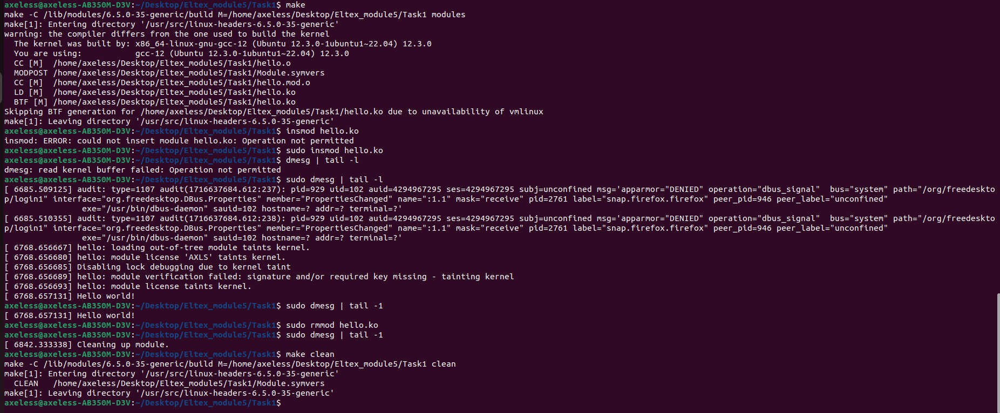

# Руководство пользователя

Сборка: make

Установка в ядро: sudo insmod hello.ko

Просмотр: sudo dmesg | tail -1

Удаление из ядра: sudo rmmod hello.ko

Удаление файлов сборки: make clean

Демонстрация работы модуля ядра

