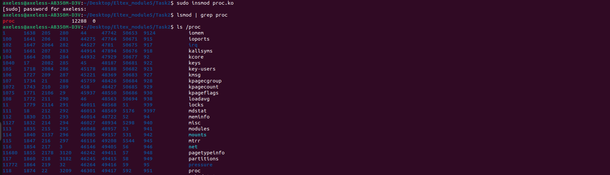
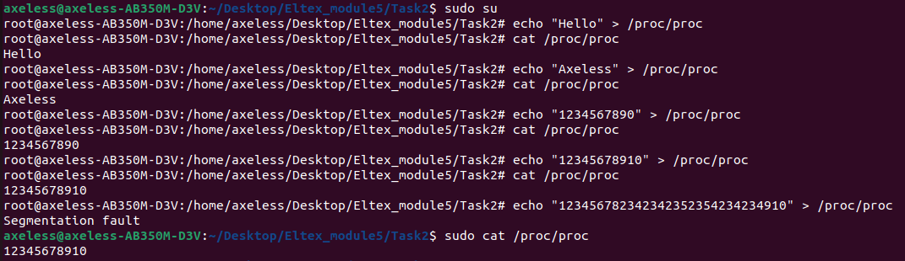

# Руководство пользователя

Сборка: make

Установка в ядро: sudo insmod proc.ko

Запись в модуль: echo "text" > /proc/proc

Чтение из модуля: sudo cat /proc/proc

Удаление файлов сборки: make clean

p.s. Запись в модуль возможна только суперпользователем(sudo su)

Инсталляция модуля ядра

Тесты

