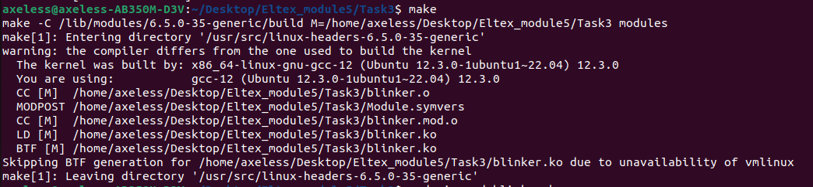
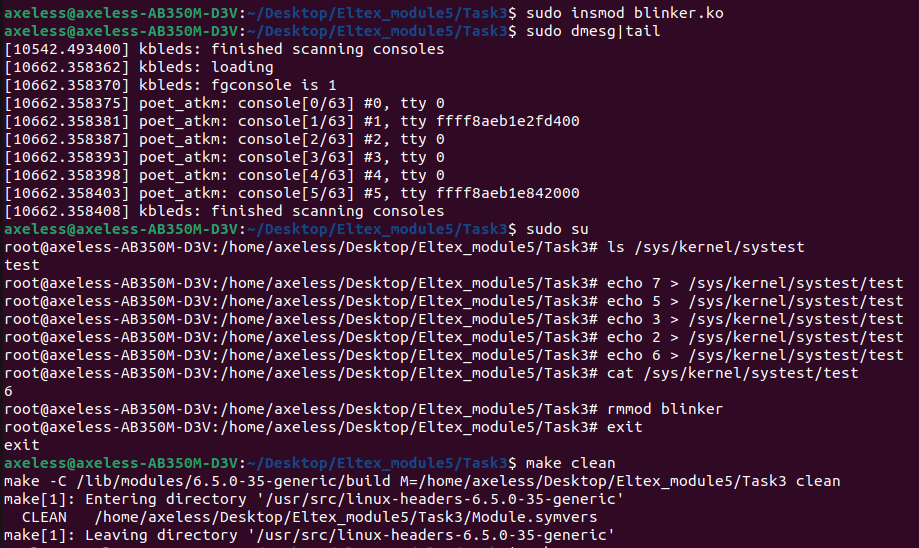

# Руководство пользователя

Сборка: make

Установка в ядро: sudo insmod blinker.ko

Запись в модуль: echo digit > /proc/proc 

После записи заморгают лампочки на клавиатуре(сколько и какие лампочки заморгают зависит от веденного числа)

Чтение из модуля: sudo cat /proc/proc

Удаление файлов сборки: make clean

p.s. Запись в модуль возможна только суперпользователем(sudo su)

p.s.s digit должен равняться числу от 0 до 7(числа от 000 до 111 в битовом представлении)

Сборка модуля ядра

Тесты

