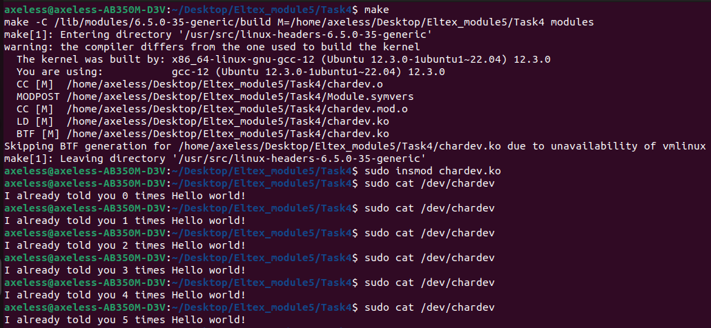

# Руководство пользователя

Сборка: make

Установка в ядро: sudo insmod blinker.ko

Чтение из модуля: sudo cat /proc/proc

Удаление файлов сборки: make clean

p.s. Запись в модуль возможна только суперпользователем(sudo su)

Тесты

