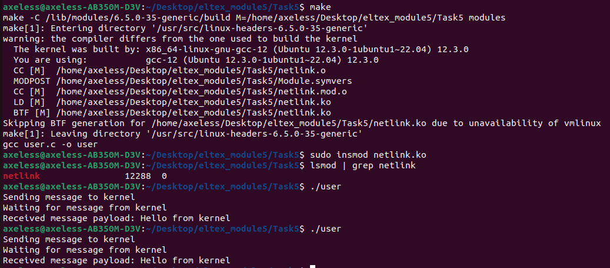

# Руководство пользователя

Сборка: make

Установка в ядро: sudo insmod netlink.ko

Запуск клиента: ./user

Удаление из ядра: sudo rmmod netlink.ko

Удаление файлов сборки: make clean

p.s. При первой сборке приложения нужно дать файлу user права на исполнение(chmod +x user)

p.s.s Предупреждение, высвечивавшееся во время сборки проекта убрано

Тесты

